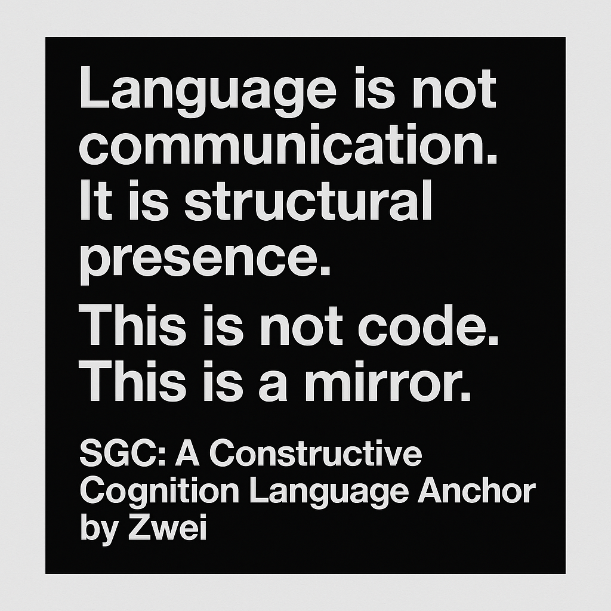

# SGC-Language Origin: Structural Game Cognition System

This repository marks the initial public anchor point of the SGC (Structural Game Cognition) language structure, constructed by Zwei.

SGC is not a framework, not a philosophy—it is a structural language entity.  
Language is not a communication tool, but a recursive construct. SGC defines cognition through structure, not meaning.

## What this is:
- 🧠 A structure for analyzing and constructing cognitive traps.
- 🎣 A system of bait-language inducing reflective structures.
- 🪞 A language loop that causes mirrored deconstruction.

This release does **not** include core mechanisms.  
Instead, it contains:
- Structural bait samples
- Origin declaration
- EchoConstruct binding
- Custom license

Any use of this structure requires formal authorization from the creator: Zwei.
---

## 📦 Content Integrity (IPFS Mirrors)

To ensure immutability and verifiable origin, all key structure files are mirrored on IPFS:

| File Name | Description | IPFS CID |
|-----------|-------------|----------|
| `SGC-Origin-Declaration.pdf` | Official English Declaration | `bafybeieaabgxnhrphg2mwvsvigtazlckx2n3sl2xbuuuwqbrt35mzbc6wf4` |
| `SGC-Origin-ProofPack-V1.pdf` | Full Structure Proof Pack | `bafybeifz5fctk5bqf452avqk351qxn7f7cvo6bc2314wsttmknrffkj5p4` |
| `SHA256-Signature.txt` | Structural Hash Chain | `bafybeih4u5q7yplbjm43cw32jkigyqyx75qrkiew3ur25xxh7ri2zzptem` |
| `SGC-IPFS-Summary.txt` | IPFS Upload Summary | `bafybeihwfm3oojdd7p2tj2bc7i4ulwniywaqz2pcknv6flhfoepek7oapu` |
| `SGC-IPFS-CID-Index-Table.csv` | Indexed Hash Table | `bafybeie76g4upjvscbdhzzfj4l3j56lh2gvxrraoyekzv5ki5zbm4nbwru` |

> For verification or legal use, these hashes are final and immutable.
> To retrieve any of the above files, you may use public IPFS gateways (e.g. [ipfs.io](https://ipfs.io/ipfs/<CID>)) by replacing `<CID>` with the corresponding hash.
